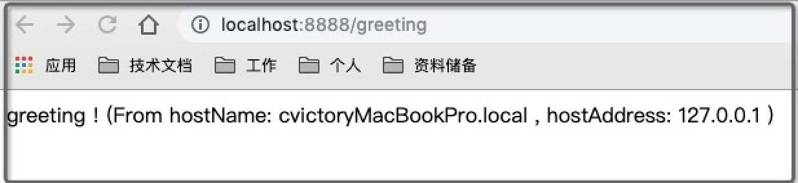

本文介绍快速搭建一个项目，让spring boot可以在最简化的k8s中运行。

此示例会作为后续k8s学习的一个demo工程。

\##### 环境说明

mac + docker + k8s +Minikube

\## 软件安装

[docker desktop community Edge版本](https://docs.docker.com/docker-for-mac/edge-release-notes/) (版本中内置了k8s)

Minikube安装：用于运行单节点的k8s集群

kubectl安装 (忘记是否需要重新安装)

\## 创建spring boot应用

通过[spring Initializr](https://start.spring.io/) 构建一个spring应用，可以选中Web和Actuator组件。

在其中增加rest请求支持：

\```

```
@RestController
public class GreetingController {

    @RequestMapping("/greeting")
    public String greeting() throws UnknownHostException {
        InetAddress address = InetAddress.getLocalHost();
        return "greeting ! (From hostName: " + address.getHostName() + " , hostAddress: " + address.getHostAddress() + " ) \n\r";
    }
}
```

\```

直接运行其中的main函数，就可启动程序。访问：http://localhost:8888/greeting ，可以直接得到页面：



\## docker支持

\#### docker配置

Dockerfile

\```

```
FROM openjdk:8-jdk-alpine
MAINTAINER victory
VOLUME /tmp
ARG DEPENDENCY=victory-spring-boot-docker
COPY target/victory-spring-boot-docker-0.0.1-SNAPSHOT.jar target/victory-spring-boot-docker-0.0.1-SNAPSHOT.jar

## 可以方便执行
COPY start.sh /usr/local/bin/start.sh
## 暴露端口
EXPOSE 8888
EXPOSE 7777

RUN apk update
## 安装基础软件
RUN apk add curl bash tree

RUN chmod 777 /usr/local/bin/start.sh

ENTRYPOINT ["start.sh"]
​```
```

start.sh

\``` start.sh

```
#!/bin/sh

java -jar target/victory-spring-boot-docker-0.0.1-SNAPSHOT.jar
```

\```

\#### 构建镜像

方式一： 

docker build -t cgjcsl/victory-spring-boot-docker .

方式二：

\```

```
<plugin>
    <groupId>com.spotify</groupId>
    <artifactId>docker-maven-plugin</artifactId>
    <version>1.2.1</version>
    <configuration>
        <imageName>cgjcsl/${project.name}:v2</imageName>
        <!--Dockerfile文件位置-->
        <dockerDirectory>${basedir}</dockerDirectory>
        <resources>
            <resource>
                <targetPath>/</targetPath>
                <directory>${project.build.directory}</directory>
                <include>${project.build.finalName}.jar</include>
            </resource>
        </resources>
    </configuration>
</plugin>
```

\```

执行 `mvn clean package docker:build`， 构建镜像。

\#### 推送镜像

 执行 `docker push cgjcsl/victory-spring-boot-docker:v1` 或者使用maven插件进行推送。

\#### 常用的其他镜像命令

docker run --name k-container -p 8080:8080 -d victory-spring-boot-docker // 直接运行容器，可以通过浏览器访问

docker ps

docker rm k-container

\## k8s容器

启动Minikube : `minikube start` 

\#### 通过rc创建pod

运行：

kubectl run victory-spring-boot-docker-k --image=cgjcsl/victory-spring-boot-docker:v1 --port=8888 --generator=run/v1

可以通过 `kubectl get pods ` 查看

\#### 查看启动日志

kubectl logs victory-spring-boot-docker-k-bzv6m -c victory-spring-boot-docker-k

\#### 进入pod

kubectl exec -it victory-spring-boot-docker-k-bzv6m bash (或者bash替换成/bin/sh)

具体如下：

\```

➜ ~ kubectl exec -it victory-spring-boot-docker-k2-zdxj2 /bin/sh        <--- 登录到容器

/ # curl http://127.0.0.1:8888/greeting

greeting ! (From hostName: victory-spring-boot-docker-k2-zdxj2 , hostAddress: 172.17.0.7 )

\```

\### 参考文档

代码地址： https://github.com/cvictory/tools/tree/master/victory-spring-boot-docker