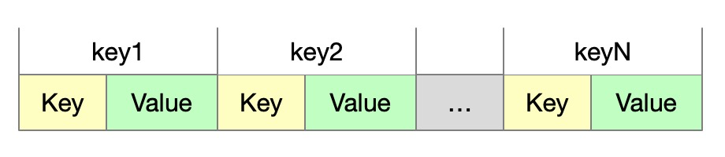
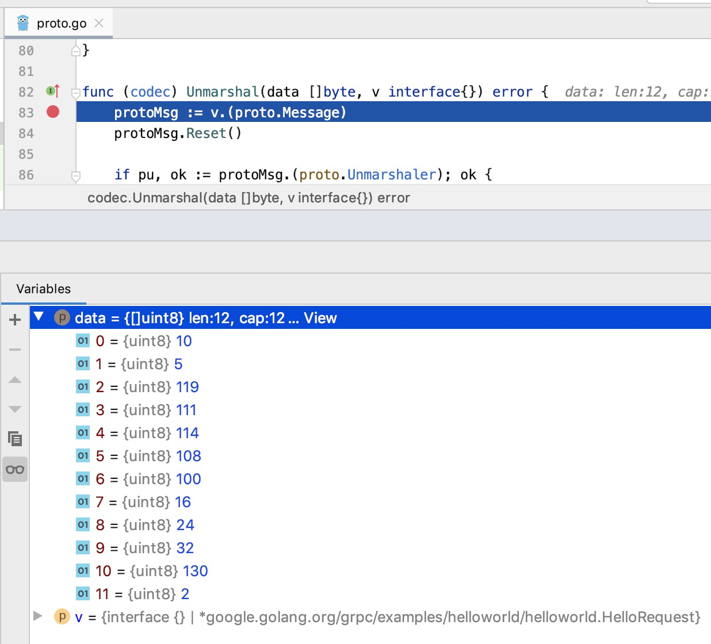

dubbo和spring cloud在国内rpc领域处于领先地位。随着云原生时代的到来，dubbo和spring cloud将面临更多挑战。其中不乏有google背书的gRpc。gRpc有往服务治理方面增强的野心，再加之本身在k8s中的强大地位，实力不可小觑。同时Service Mesh也是野心勃勃，有统一网络通信的模式。

未来在微服务领域，最后谁将胜出，还需要时间证明。作为rpc领域从业者，需要了解对手，所以会开始学习gRpc和Istio相关内容。 gRpc的关键知识很多，会有单独的文章进行介绍。这里先来学习一波gRpc中最重要的编码器(序列化)：protocol buffers。

本文不是参考文档，所以讲述的部分内容会进行简化，如果想要获取更加完整的知识，可以参考[官网](https://developers.google.com/protocol-buffers)。

## 特点介绍

提供IDL的能力。通过定义结构化数据存储格式，可以生成各个语言和数据结构和对应的服务。

高效性。序列化的时间复杂度低，空间占用少。可以从google中查到大量的性能对比。

跨平台。go语言中序列化有go-gob ; java语言中序列化方式有hessian，fastjson等。 而跨平台的其他支持有thrift，但是维护的不够稳定。

大厂支持。google内部大量采用，也是gRpc通信的基础。

## 语言指南

#### 定义一个消息

```
// 指明是proto3的语法
syntax = "proto3";

message SearchRequest {
  string query = 1;   // 类型 变量名 序列号
  int32 page_number = 2;
  int32 result_per_page = 3;
}
```

序列号必须是唯一的。如果序列号是1到15之间，只占用一个字节；如果是16 到 2047，会占用2个字节。(后面的编码章节中会有介绍)

##### repeated

重复的数据，一般和packed配合使用。

##### Reserved

保留序列号。

#### 代码生成

java语言中，会根据.proto生成对应的.java文件; go语言，会根据.proto生成对应的.go文件。

```shell
protoc --proto_path=IMPORT_PATH --cpp_out=DST_DIR --java_out=DST_DIR --python_out=DST_DIR --go_out=DST_DIR --ruby_out=DST_DIR --objc_out=DST_DIR --csharp_out=DST_DIR path/to/file.proto
```

go语言的代码生成器可以参考[这里](https://developers.google.com/protocol-buffers/docs/reference/go-generated)。

#### 数据类型

| .proto Type | Notes                                                        | C++ Type | Java Type  | Go Type |
| ----------- | ------------------------------------------------------------ | -------- | ---------- | ------- |
| double      |                                                              | double   | double     | float64 |
| float       |                                                              | float    | float      | float32 |
| int32       | Uses variable-length encoding. Inefficient for encoding negative numbers – if your field is likely to have negative values, use sint32 instead. | int32    | int        | int32   |
| int64       | Uses variable-length encoding. Inefficient for encoding negative numbers – if your field is likely to have negative values, use sint64 instead. | int64    | long       | int64   |
| uint32      | Uses variable-length encoding.                               | uint32   | int[1]     | uint32  |
| uint64      | Uses variable-length encoding.                               | uint64   | long[1]    | uint64  |
| sint32      | Uses variable-length encoding. Signed int value. These more efficiently encode negative numbers than regular int32s. | int32    | int        | int32   |
| sint64      | Uses variable-length encoding. Signed int value. These more efficiently encode negative numbers than regular int64s. | int64    | long       | int64   |
| fixed32     | Always four bytes. More efficient than uint32 if values are often greater than 228. | uint32   | int[1]     | uint32  |
| fixed64     | Always eight bytes. More efficient than uint64 if values are often greater than 256. | uint64   | long[1]    | uint64  |
| sfixed32    | Always four bytes.                                           | int32    | int        | int32   |
| sfixed64    | Always eight bytes.                                          | int64    | long       | int64   |
| bool        |                                                              | bool     | boolean    | bool    |
| string      | A string must always contain UTF-8 encoded or 7-bit ASCII text, and cannot be longer than 232. | string   | String     | string  |
| bytes       | May contain any arbitrary sequence of bytes no longer than 232. | string   | ByteString | []byte  |

还支持php，python等语言，篇幅原因不再列出。

#### 枚举

```
message SearchRequest {
  string query = 1;
  int32 page_number = 2;
  int32 result_per_page = 3;
  enum Corpus {
    UNIVERSAL = 0;
    WEB = 1;
    IMAGES = 2;
    LOCAL = 3;
    NEWS = 4;
    PRODUCTS = 5;
    VIDEO = 6;
  }
  Corpus corpus = 4;
}
```

#### 导入定义文件

```protobuf
import "myproject/other_protos.proto";
```

#### 嵌套类型

```protobuf
message SearchResponse {
  message Result {
    string url = 1;
    string title = 2;
    repeated string snippets = 3;
  }
  repeated Result results = 1;
}
```

#### Any / Oneof

any表示任何类型，Oneof指对应

#### Map

```
map<string, Project> projects = 3;
```

#### Package

包名，在java和go语言中分别有对应的生成机制。

#### 服务定义

```protobuf
service SearchService {
  rpc Search (SearchRequest) returns (SearchResponse);
}
```

上述的介绍只是概括性的，我只是作为一个搬运工。想要了解更多知识，可以参考[文档](https://developers.google.com/protocol-buffers/docs/proto3 ).

## 编码和解码


编码(序列化)后的信息的格式如上图。先介绍一些编码方面的原理，然后通过一个例子来实践。

#### key的产生

key产生方式  =   (field_number << 3) | wire_type  （编码阶段，如果解码要逆向进行）

如果key是结果是1个字节，那么field_number只有5位是有效的数字位，所以最多能标识2^5 -1个序列号，也就是15个序列号。

| Type | Meaning          | Used For                                                 |
| ---- | ---------------- | -------------------------------------------------------- |
| 0    | Varint           | int32, int64, uint32, uint64, sint32, sint64, bool, enum |
| 1    | 64-bit           | fixed64, sfixed64, double                                |
| 2    | Length-delimited | string, bytes, embedded messages, packed repeated fields |
| 3    | Start group      | groups (deprecated)                                      |
| 4    | End group        | groups (deprecated)                                      |
| 5    | 32-bit           | fixed32, sfixed32, float                                 |

#### value的一些特质

###### varint

为了节约int的内存，所以采用了从1字节到4字节的可变的int类型，类似于utf-8编码。

Varint 中的每个 byte 的最高位 bit 有特殊的含义，如果该位为1，表示后续的 byte 也是该数字的一部分，如果该位为 0，则结束。其他的 7 个 bit 都用来表示数字。

比如小于 128 的数字只需要1个byte。比如 300，会用两个字节来表示：1010 1100 0000 0010 .

###### string

用TLV结构表示。T = Key， L代表字符的长度，V代表值，如tesing=74 65 73 74 69 6e 67。

```protobuf
message Test2 {
  optional string b = 2;
}
```

值是 "testing" 的整个message编码如下：

```
12 07 74 65 73 74 69 6e 67
```

###### option / repeat

option、repeat可以不传输数据，减少数据量

编码解码参考[文档](https://developers.google.com/protocol-buffers/docs/encoding) .

## grpc请求中的案例

编写一个gRpc请求过程中的案例，通过debug展示下序列化的数据转换。例子来源于[gRpc go example](https://github.com/grpc/grpc-go/tree/master/examples/helloworld , 为了展示更加多样的数据类型对例子中的参数做了一些修改。

#### 编写helloworld.proto

```protobuf
syntax = "proto3";

option java_multiple_files = true;
option java_package = "io.grpc.examples.helloworld";
option java_outer_classname = "HelloWorldProto";

package helloworld;

// The greeting service definition.
service Greeter {
  // Sends a greeting
  rpc SayHello (HelloRequest) returns (HelloReply) {}
}

// The request message containing the user's name.
message HelloRequest {
  string name = 1;
  uint32 id = 2;
  string desc = 3;
  uint32 key = 4;
}

// The response message containing the greetings
message HelloReply {
  string message = 1;
  uint32 id = 2;
}
```

#### go生成器

protoc --go_out=plugins=grpc:. *.proto

#### gRpc server

```
package main

import (
	"context"
	"log"
	"net"

	"google.golang.org/grpc"
	pb "google.golang.org/grpc/examples/helloworld/helloworld"
)

const (
	port = ":50051"
)

// server is used to implement helloworld.GreeterServer.
type server struct {
	pb.UnimplementedGreeterServer
}

// SayHello implements helloworld.GreeterServer
func (s *server) SayHello(ctx context.Context, in *pb.HelloRequest) (*pb.HelloReply, error) {
	log.Printf("Received: %v", in.GetName())
	return &pb.HelloReply{Message: "Hello " + in.GetName()}, nil
}

func main() {
	lis, err := net.Listen("tcp", port)
	if err != nil {
		log.Fatalf("failed to listen: %v", err)
	}
	s := grpc.NewServer()
	pb.RegisterGreeterServer(s, &server{})
	if err := s.Serve(lis); err != nil {
		log.Fatalf("failed to serve: %v", err)
	}
}
```

#### gRpc client

```
package main

import (
	"context"
	"log"
	"os"
	"time"

	"google.golang.org/grpc"
	pb "google.golang.org/grpc/examples/helloworld/helloworld"
)

const (
	address     = "localhost:50051"
	defaultName = "world"
)

func main() {
	// Set up a connection to the server.
	conn, err := grpc.Dial(address, grpc.WithInsecure())
	if err != nil {
		log.Fatalf("did not connect: %v", err)
	}
	defer conn.Close()
	c := pb.NewGreeterClient(conn)

	// Contact the server and print out its response.
	name := defaultName
	if len(os.Args) > 1 {
		name = os.Args[1]
	}
	ctx, cancel := context.WithTimeout(context.Background(), time.Second)
	defer cancel()
	r, err := c.SayHello(ctx, &pb.HelloRequest{Name: name, Id: 24, Key: 258})
	if err != nil {
		log.Fatalf("could not greet: %v", err)
	}
	log.Printf("Greeting: %s", r.GetMessage())
}
```

#### 运行

debug方式运行gRpc server，主要观察server端的序列化和反序列化。

run方式运行gRpc client。

#### 序列化过程

client端发起请求的参数如下：

```
name := "world"
r, err := c.SayHello(ctx, &pb.HelloRequest{Name: name, Id: 24, Key: 258})
```

HelloRequest结构如下：

```
message HelloRequest {
  string name = 1;
  uint32 id = 2;
  string desc = 3;
  uint32 key = 4;
}
```

从client端传递到server端的数据内容如下：



###### 第一组

10 (二进制：1010)作为key，做一次转换，计算wire_type和field_number。

wire_type = 1010 & 111 (二进制) = 2 ；

field_number = 1010 >> 3 = 1

所以这个key-value结构的序号为1，类型2对应为string。 因为是string类型，所以是LV结构，5代表长度，[119,111,114,108,100]为对应的字符，值为world。

###### 第二组

按照上述的方法，计算16，得到wire_type和field_number分别为0和2。通过上面的对应关系的表格，0对应varint。所以值为24，没有超过128。

第三组

通过计算32得到wire_type和field_number分别为0和4，0对应为varint。

但130>128,2<128, 所以该int值占用了2个字节：10000010, 00000010。 value计算公式如下：

2^1 << 7 + 2^1 = 258

由于desc字段没有值，所以不占用任何传输空间。

## Protobuf API能力

```
// 编码
func Marshal(pb Message) ([]byte, error)
// 解码
func Unmarshal(buf []byte, pb Message) error
```

更多的api的文档请参考[文档](https://godoc.org/github.com/golang/protobuf/proto#Marshal)，不过大部分同学对这块的依赖度和关注度比较低。本人也是在debug gRpc序列化过程中才对这一块只是有所关注。
更多api例子请[参考](https://github.com/protocolbuffers/protobuf/tree/master/examples)

## 横向比较

网上资料已经够多，所以不做阐述，直接google。

## 总结

protocol buffers是由google推出的跨平台的IDL解决方案，被用于数据传输过程中的编码解码。在性能和空间占比上都处于较为领先的位置。k8s作为云原生的事实标准，gRpc是k8s中的最常见的通信工具，所以protocol buffer的重要性不言而喻。

上文中粗略地介绍了protobuf的语法，编码解码的原理，以及通过一个gRpc的调用分析，方便我们更加熟悉protobuf中的一些技术细节。如果想更加深入学习，首先阅读一遍官方的参考文档；然后根据官方提供的sample或者直接借助gRpc的demo，深入protocol的源码学习。你只需要选择其中一门语言(java、go等)作为学习的材料。

